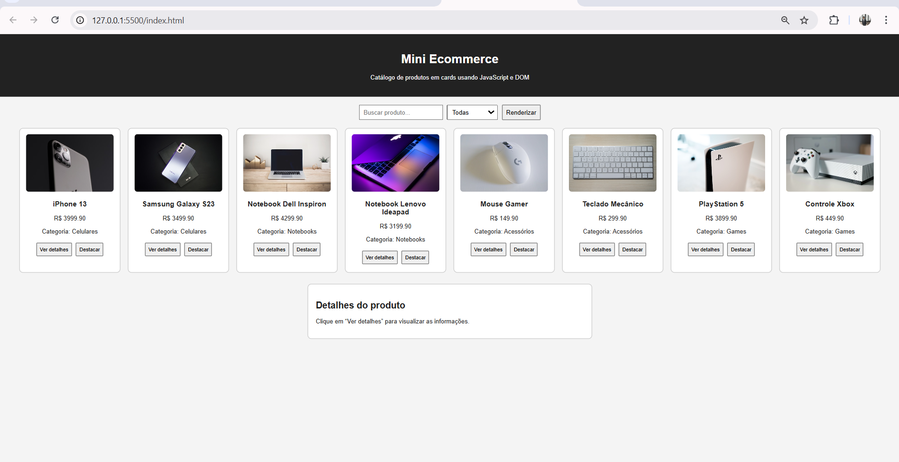
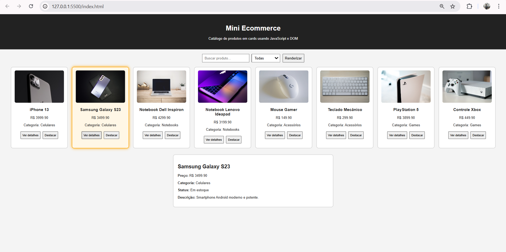

# Atividade Prática - Funções e Manipulação do DOM

## Informações do aluno

Nome: Davi Martins Alves  
Matrícula: 917012  
Curso: Engenharia de Software  
Campus: Coração Eucarístico  

## Descrição

Nesta atividade foi desenvolvido um Mini Ecommerce usando HTML, CSS e JavaScript.

A página exibe produtos em cards a partir de uma base de dados em formato JSON, permitindo:

- listar produtos;
- buscar produtos pelo nome;
- filtrar por categoria;
- visualizar detalhes;
- destacar cards;
- manipular elementos da página com DOM.

## Funcionalidades implementadas

- Uso de `getElementById`
- Uso de `querySelector`
- Uso de `querySelectorAll`
- Uso de `innerHTML`
- Uso de `createElement`
- Uso de `setAttribute`
- Uso de `appendChild`
- Uso de `classList.add`
- Uso de `style`
- Uso de `addEventListener`

## Prints

### Tela com os cards renderizados

### Detalhes do produto

### Console do navegador

